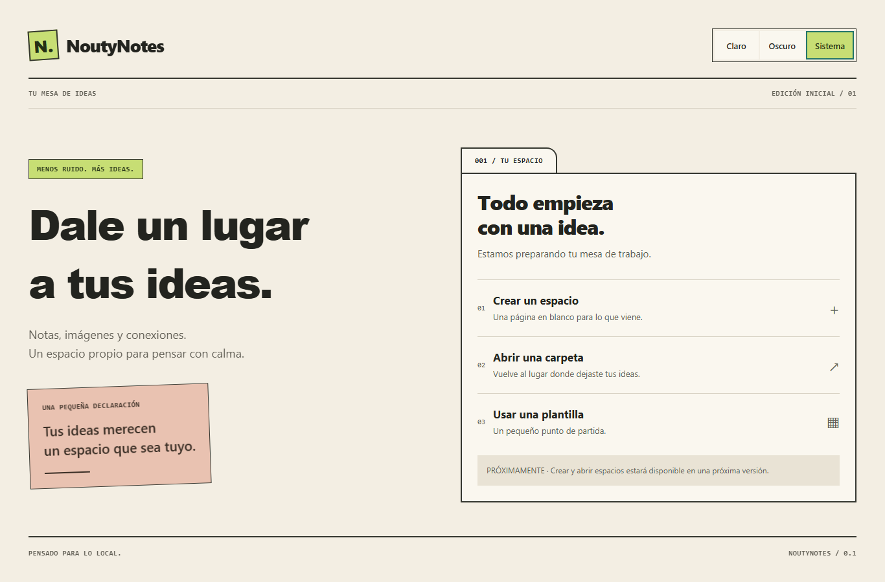

# NoutyNotes

**Un lugar para tus ideas.**

NoutyNotes es un proyecto de espacio visual para organizar notas Markdown, imágenes, tarjetas y relaciones sobre una grilla. Su objetivo es funcionar con archivos locales y compartir un mismo núcleo entre web y Android.

> **En desarrollo inicial.** Actualmente funciona la pantalla de bienvenida y el cambio de tema. Crear espacios, abrir carpetas, editar notas y usar plantillas todavía no están disponibles.



## Estado actual

La fase 0B, base técnica, está completada. El siguiente paso es implementar el dominio y sus reglas, antes de añadir edición o persistencia.

| Disponible | Pendiente |
| --- | --- |
| App Expo con navegación mediante Expo Router | Espacios, tableros y tarjetas |
| Inicio responsive para escritorio y móvil | Editor Markdown y gestión de imágenes |
| Temas claro, oscuro y del sistema | Grilla, relaciones y plantillas |
| TypeScript estricto, lint y pruebas automatizadas | Guardado, apertura e importación/exportación |
| Export web, bundle Android y proyecto nativo generado | Ejecución Android verificada y arranque web sin conexión |

La preferencia de tema dura la sesión actual. Los botones de crear, abrir y usar plantillas aparecen desactivados. Hay una [demo inicial en GitHub Pages](https://sebhernandezamoros.github.io/NoutyNotes/); todavía no hay un APK validado. Está pendiente corregir una diferencia visual: el export puede mostrar una sola columna en escritorio en lugar de las dos del desarrollo local.

## Tecnologías

| Herramienta | Versión |
| --- | --- |
| Node.js | 24.11 o posterior de la rama 24 |
| Gestor de paquetes | pnpm 11.17.0 |
| Expo | SDK 57 |
| React Native / React | 0.86.3 / 19.2.3 |
| TypeScript | 6.0 |
| Calidad | ESLint, Vitest y Playwright |

Las versiones concretas están fijadas en los manifiestos y en `pnpm-lock.yaml`. El proyecto usa pnpm workspaces y un único lockfile.

## Ejecutar

Requisitos: Node.js y pnpm en las versiones indicadas. Desde una copia del repositorio, ejecutar en la raíz:

```sh
pnpm install --frozen-lockfile
pnpm web
```

Abrir la dirección indicada por Expo, normalmente `http://localhost:8081`. Detener el servidor con `Ctrl+C`. Si el puerto está ocupado, usar `pnpm web --port 8082`.

### Android

Se necesita Android Studio, SDK, Java y un emulador o dispositivo configurados:

```sh
pnpm android:prepare
pnpm android
```

`android:prepare` genera o actualiza el proyecto nativo sin limpiarlo ni instalar dependencias. `android` compila e intenta instalar la app, y puede descargar herramientas adicionales.

Se verificaron la generación del proyecto nativo y el bundle Hermes. La compilación e instalación de un APK en dispositivo o emulador siguen pendientes de validación.

## Validar

```sh
pnpm check
pnpm exec playwright install chromium
pnpm test:smoke
pnpm build:web
pnpm build:android:bundle
pnpm android:prepare
```

Chromium se instala una vez por entorno; en Linux puede requerir también sus dependencias del sistema. Playwright inicia el servidor web durante las pruebas; no hace falta iniciarlo manualmente.

| Comando | Qué comprueba o genera |
| --- | --- |
| `pnpm check` | Lint, TypeScript y pruebas unitarias |
| `pnpm lint` | ESLint sin avisos permitidos |
| `pnpm typecheck` | Tipos de paquetes, pruebas y aplicación |
| `pnpm test` | Pruebas unitarias de selección de tema y contraste |
| `pnpm test:smoke` | Inicio web, temas y acciones desactivadas en escritorio y móvil |
| `pnpm build:web` | Export estático en `apps/noutynotes/dist/` |
| `pnpm build:android:bundle` | JavaScript y assets en `apps/noutynotes/dist/android/`; no produce un APK |
| `pnpm android:prepare` | Proyecto nativo generado en `apps/noutynotes/android/` |

Ejecutar el bundle Android después del export web, porque este último regenera `dist/`. Las capturas y trazas de Playwright se guardan en `artifacts/playwright/`.

Para una revisión manual, cambiar entre Claro/Oscuro/Sistema y reducir el ancho de la ventana a 390 px. El contenido debe seguir siendo legible, sin desplazamiento horizontal, y las tres acciones futuras deben permanecer desactivadas.

**Validación local registrada el 23 de septiembre de 2026:** instalación con lockfile congelado, lint y tipos correctos; 5 pruebas unitarias y 2 pruebas web correctas; export web, bundle Android y generación nativa correctos. Estos resultados no equivalen a ejecución nativa Android.

El [workflow de GitHub Actions](.github/workflows/ci.yml) está preparado para ejecutar las comprobaciones en pushes y pull requests. Su ejecución remota todavía no se ha verificado.

## GitHub Pages

La configuración para publicar esta demo inicial está en [Deploy GitHub Pages](.github/workflows/pages.yml). El usuario confirmó la carga de la demo mediante una captura el 23 de septiembre de 2026 en `https://SebHernandezAmoros.github.io/NoutyNotes/`. La equivalencia visual con el desarrollo local sigue pendiente de corrección y validación.

El workflow instala con pnpm, ejecuta lint/tipos/tests, exporta con la ruta base `/NoutyNotes` y comprueba el resultado en escritorio y móvil antes de publicarlo. Los pushes a `main` publican automáticamente; los pull requests hacia `main` solo construyen y validan. También puede iniciarse manualmente desde Actions en `main`.

### Activar la publicación

1. Subir estos archivos a la rama `main` del repositorio.
2. En GitHub, abrir **Settings → Pages → Build and deployment → Source** y seleccionar **GitHub Actions**.
3. Abrir **Actions → Deploy GitHub Pages → Run workflow**, seleccionar `main` y ejecutar. Si el primer push falló porque Pages aún no estaba habilitado, repetir el workflow después de activarlo.
4. Esperar a que terminen correctamente los trabajos `build` y `deploy`, y abrir la URL del despliegue.

No se necesita una rama `gh-pages`, publicar `Docs/` ni añadir un token personal. Se utiliza el token del workflow con permisos de Pages y se sube únicamente `apps/noutynotes/dist/pages/`.

### Comprobar el export antes de subir

```sh
pnpm build:pages
pnpm test:pages
pnpm preview:pages
```

Para las pruebas se necesita Chromium instalado con `pnpm exec playwright install chromium`. La vista previa abre un servidor en `http://127.0.0.1:8082/NoutyNotes/`; detenerlo con `Ctrl+C`. `test:pages` inicia y cierra su propio servidor, por lo que el puerto 8082 debe estar libre. Las capturas quedan en `artifacts/playwright-pages/`.

`build:pages` genera `apps/noutynotes/dist/pages/` y aplica la ruta base solo a ese proceso. El desarrollo local y el export web normal mantienen la ruta raíz. Ejecutar `build:pages` después de `build:web`, que regenera `dist/`. Si cambia el nombre del repositorio o se configura un dominio propio, ajustar la ruta en `apps/noutynotes/app.config.ts` y la vista previa correspondiente.

Esta demo muestra el inicio y los temas; no incorpora guardado ni funcionamiento offline. Configuración basada en las guías de [Expo](https://docs.expo.dev/guides/publishing-websites/#github-pages) y [GitHub Actions para Pages](https://docs.github.com/en/pages/getting-started-with-github-pages/using-custom-workflows-with-github-pages).

## Arquitectura

```text
apps/noutynotes/        App Expo, rutas y pantalla inicial
packages/domain/       Reserva para entidades y reglas puras
packages/application/  Reserva para casos de uso y puertos
packages/storage/      Reserva para adaptadores de persistencia
packages/ui/           Tokens y proveedor de temas compartidos
tests/                 Smoke web y carpetas para futuras pruebas
assets/readme/         Capturas propias para esta documentación
```

La app y el paquete UI están activos. Las capas de dominio, aplicación y almacenamiento tienen su ubicación preparada; sus funcionalidades todavía no están implementadas. El dominio se mantendrá independiente de React, Expo y filesystem. Los casos de uso dependerán de puertos que implementarán los adaptadores de almacenamiento.

## Plan de trabajo

| Etapa | Alcance | Estado |
| --- | --- | --- |
| A — Fundaciones | Estructura, herramientas, inicio y temas | Completada |
| B — Núcleo | Dominio, grilla, relaciones y plantillas | Siguiente; comienza por dominio |
| C — Persistencia y prototipo | Serialización, almacenamiento en memoria y edición básica | Pendiente |
| D — Web y Android | Carpetas, importación/exportación y persistencia nativa | Pendiente |
| E — Experiencia y calidad | Plantillas en UI, móvil, regresión y rendimiento | Pendiente |
| F — Publicación y v1 | Demo, documentación completa y release | Pendiente |

La visión del producto es trabajar con Markdown/YAML y assets portables como fuente de verdad, sin backend obligatorio, cuentas, plugins ejecutables ni Git integrado. El almacenamiento local y el funcionamiento sin conexión se implementarán y validarán en sus fases correspondientes.

## Contribuir

Mantener los cambios acotados a la fase actual, respetar los límites entre capas y ejecutar las comprobaciones relevantes antes de proponer un cambio. Para cambios de interfaz, revisar también escritorio, móvil y ambos temas. Actualizar este README cuando cambien los comandos o el comportamiento disponible.

La planificación detallada y la bitácora de trabajo se mantienen localmente en `Docs/`, excluido del repositorio. La aplicación no necesita esa carpeta para instalarse ni ejecutarse; este README contiene las instrucciones públicas.

## Licencia

[MIT](LICENSE).
